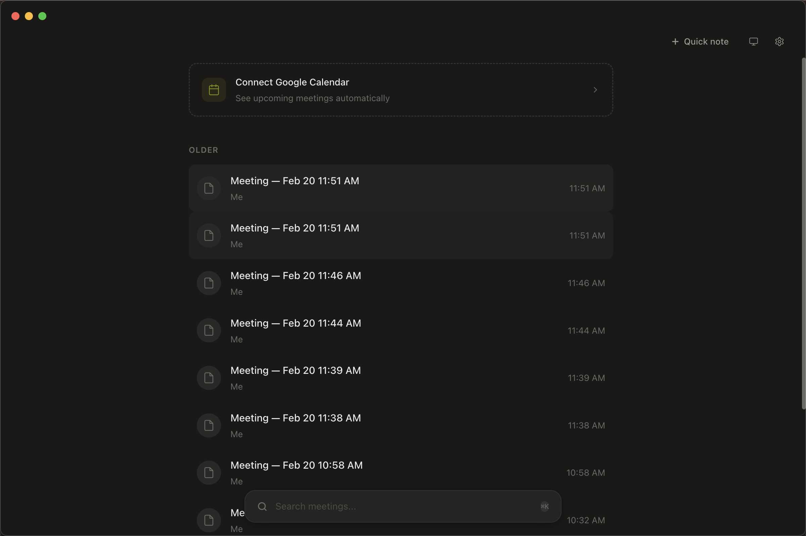

# Phillnola

An open-source, local-first AI meeting notes app. No bot joins your call. No data leaves your machine. Your API keys. Your data.

   



---

## Features

- **Real-time audio recording** -- captures both system audio and microphone, merges them via Web Audio API
- **Whisper transcription** -- sends audio chunks to OpenAI Whisper (or a local endpoint) for speech-to-text
- **AI-structured notes** -- takes your raw notes plus the transcript and produces structured meeting summaries using OpenAI or Anthropic
- **Rich text editor** -- TipTap-based editor with headings, lists, task lists, code blocks, and markdown shortcuts
- **Customizable recipes** -- define different AI prompts for different meeting types (standup, 1:1, interview, etc.)
- **Google Calendar integration** -- connects to your Google Calendar to show upcoming events and auto-create meetings
- **System tray** -- quick access to recent meetings and recording controls from the macOS menu bar
- **Search** -- full-text search across meeting titles and note contents
- **Export** -- copy notes to clipboard as markdown, or export as `.md` files
- **Themes** -- system, light, and dark theme support with smooth transitions
- **Keyboard shortcuts** -- fast navigation without leaving the keyboard
- **SQLite storage** -- all data stored locally in `~/.phillnola/phillnola.db`

## Setup

```bash
# Clone the repository
git clone https://github.com/phillipan14/phillnola.git
cd phillnola

# Install dependencies
npm install

# Rebuild native modules for Electron
npx electron-rebuild

# Start in development mode
npm run dev
```

## Architecture

```
phillnola/
  electron/           Electron main process
    main.ts           App entry, window management, IPC handlers, system tray
    preload.ts        Context bridge (window.phillnola API)
    db.ts             SQLite database (better-sqlite3) — meetings, notes, recipes, settings
    migrations.ts     Schema migrations and seed data
    audio-capture.ts  Audio chunk file management
    transcribe.ts     Whisper API integration
    ai-structure.ts   OpenAI / Anthropic note structuring
    google-calendar.ts Google Calendar OAuth + event fetching
  src/                React renderer process
    App.tsx           Main application shell — sidebar, editor, recording
    index.tsx         React entry point
    components/
      Editor.tsx      TipTap rich text editor wrapper
      EditorToolbar.tsx Floating formatting toolbar
      RecordingBar.tsx  Recording status bar with waveform
      ProcessingOverlay.tsx Transcription/structuring progress overlay
    hooks/
      useEditor.ts    TipTap editor instance, auto-save, content loading
      useRecording.ts Audio capture lifecycle (MediaRecorder + Web Audio)
      useSettings.ts  Settings state management
    screens/
      Onboarding.tsx  First-run setup (API key, provider selection)
      Settings.tsx    Settings panel (API keys, calendar, audio device)
    styles/
      globals.css     Theme variables, component styles, animations
```

**Stack:** Electron 40 + React 19 + TailwindCSS 4 + Vite 7 + TipTap 3 + SQLite (better-sqlite3)

## Keyboard Shortcuts

| Shortcut | Action |
|----------|--------|
| `Cmd+K` | Focus search input |
| `Cmd+N` | Create a new meeting |
| `Cmd+Shift+R` | Start / stop recording |
| `Cmd+B` | Bold (in editor) |
| `Cmd+I` | Italic (in editor) |
| `Cmd+Shift+7` | Ordered list (in editor) |
| `Cmd+Shift+8` | Bullet list (in editor) |

## Configuration

### API Keys

On first launch, the onboarding screen asks for an API key. You can change it later in Settings.

- **OpenAI** -- used for Whisper transcription and (optionally) GPT note structuring
- **Anthropic** -- used for Claude note structuring

At minimum, an OpenAI key is required for transcription. Choose your preferred provider for structuring in Settings.

### Google Calendar

1. Open Settings and click "Connect Google Calendar"
2. Complete the OAuth flow in your browser
3. Upcoming events will appear in the sidebar automatically

### Audio

Phillnola captures both system audio (via Electron desktopCapturer) and microphone input. You can select a specific microphone device in Settings. macOS will prompt for Screen Recording and Microphone permissions on first use.

## Building

```bash
# Full production build (Electron + Vite)
npm run build

# Package as macOS .dmg
npm run dist

# Package as directory (for testing, no .dmg)
npm run dist:dir
```

## License

MIT
